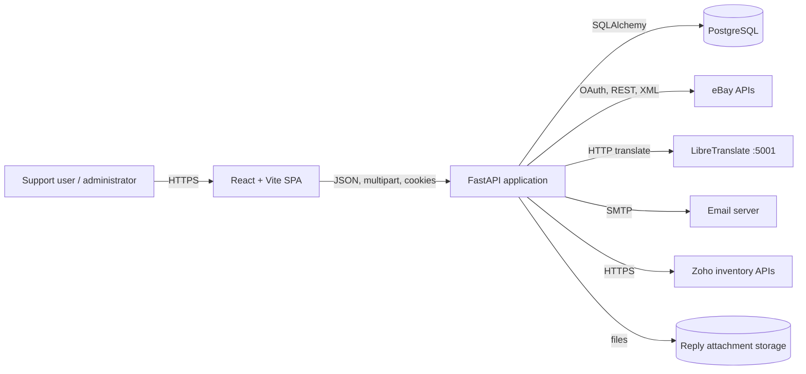
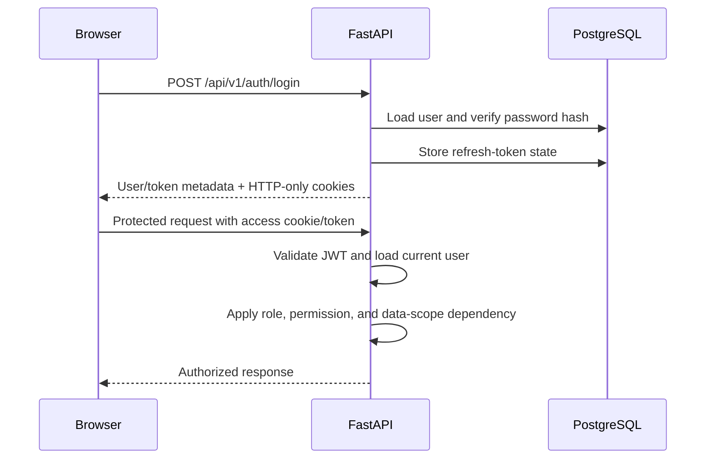
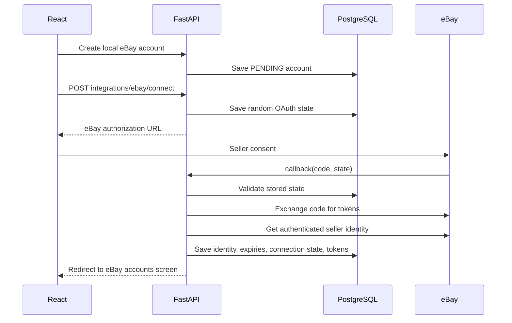
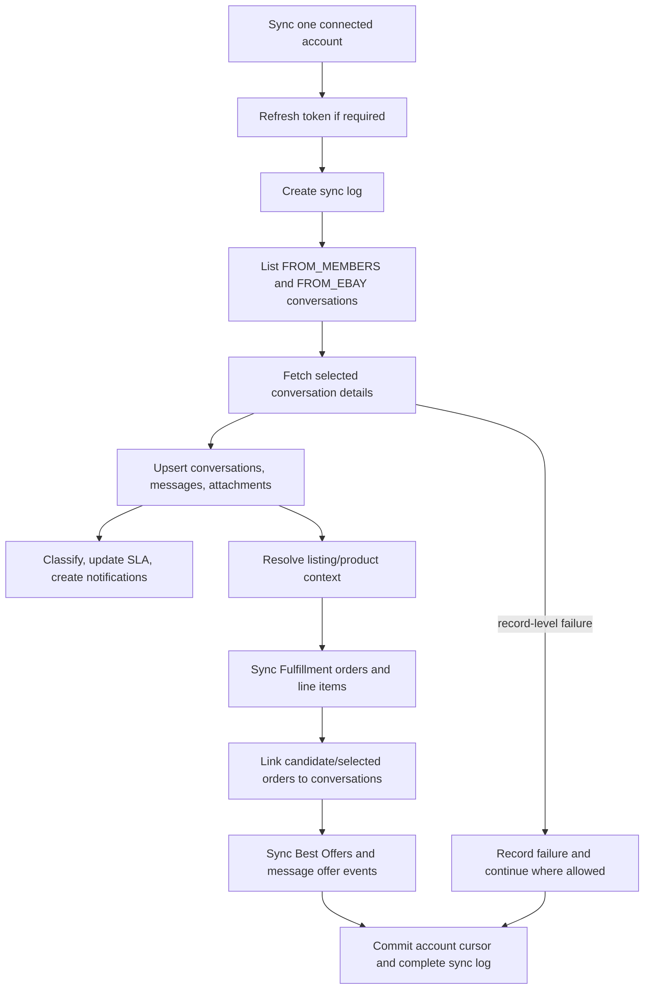
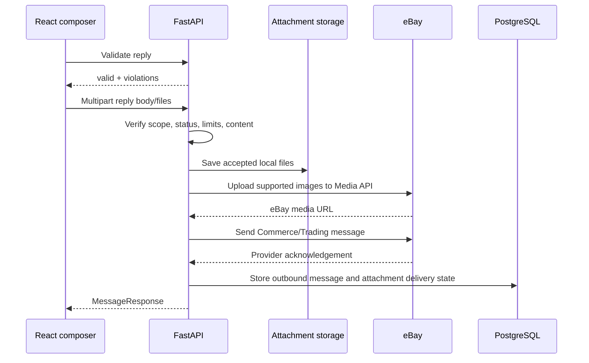
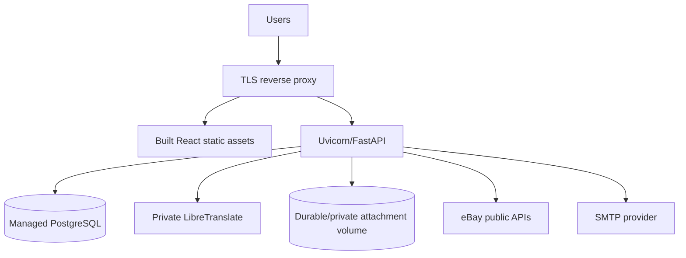

# ACES System Architecture

## 1. Purpose and Scope

ACES is a modular monolith for eBay customer-support and operations teams. A React single-page application communicates with a FastAPI backend. FastAPI owns authentication, authorization, workflows, eBay integration, translation orchestration, and persistence. PostgreSQL is the system of record; eBay remains the provider system of record for marketplace messages, orders, listings, and offers.

The browser does not receive eBay OAuth tokens and does not call eBay APIs directly.

## 2. System Context



## 3. Runtime Topology

Local development uses three long-running terminals:

```text
Terminal 1: FastAPI/Uvicorn  :8000
Terminal 2: React/Vite       :5173
Terminal 3: LibreTranslate   :5001
External:   PostgreSQL       :5432 by convention
```

Production can place a TLS reverse proxy in front of the frontend and backend. PostgreSQL and attachment storage must be durable. LibreTranslate can remain a separate private service, with its URL configured through `TRANSLATION_API_URL`.

## 4. Repository Architecture

```text
backend/app/
|-- api/
|   |-- dependencies.py       Authentication and authorization dependencies
|   `-- v1/
|       |-- router.py         Global router composition
|       `-- routes/           Core HTTP controllers
|-- core/
|   |-- config.py             Environment-backed settings
|   `-- security.py           Password and JWT primitives
|-- db/
|   |-- base.py               SQLAlchemy declarative base
|   `-- session.py            Engine/session dependency
|-- models/                   Shared SQLAlchemy entities
|-- schemas/                  Shared Pydantic request/response contracts
|-- repositories/             Database access and reusable queries
|-- services/                 Cross-domain/application orchestration
|-- modules/                  Feature-owned models, schemas, services, routers
|   |-- integrations/ebay/    eBay clients, OAuth, sync, normalization
|   |-- offer_management/
|   |-- sold_posting/
|   |-- pms/
|   |-- daily_task_entry/
|   |-- task_management/
|   |-- leave_management/
|   |-- config_management/
|   `-- search_sku/
`-- main.py                   Application factory and lifespan tasks

frontend/src/
|-- pages/                    Feature screens and view components
|-- services/                 Typed-by-convention HTTP client functions
|-- components/               Shared UI components
|-- contexts/                 Session/global React context
|-- routes/                   Route/access composition
`-- App.jsx                   SPA entry and route shell
```

## 5. Backend Layering

### HTTP Layer

FastAPI routers parse path/query/body data, apply dependency-based authorization, call a service, and serialize the response. The global router mounts all versioned endpoints at `/api/v1`.

### Schema Layer

Pydantic models define request validation and response serialization. They prevent ORM internals, secrets, and provider-specific payload details from leaking into frontend contracts.

### Service Layer

Services implement business transactions and orchestration: login/token rotation, conversation visibility, sync, reply validation/sending, classification, notifications, reporting, PMS calculations, and operational modules.

### Repository Layer

Repositories encapsulate SQLAlchemy queries and persistence operations for shared domains. Feature modules may use their own repositories or service-owned queries where the module boundary is stronger than the shared model boundary.

### Model Layer

SQLAlchemy models map PostgreSQL records. Alembic migrations in `backend/alembic/versions` are the schema history and must be applied before running a newer backend revision.

## 6. Core Domain Boundaries

| Domain | Responsibilities | Principal storage |
|---|---|---|
| Authentication | Users, roles, permissions, access/refresh tokens, password reset | users, roles, permissions, refresh/reset token tables |
| eBay accounts | Seller identity, environment, connection state, OAuth token lifecycle | `ebay_accounts` |
| Inbox | Conversations, participants, messages, media, status, category | conversation/message tables |
| Assignment and SLA | Active assignment history, response cycles, user/category scope | assignment and SLA tables |
| Orders/context | Orders, line items, returns, cancellations, conversation linking | order-context tables |
| Offers | Provider offer normalization and conversation offer cards | `offers` and listing sync state |
| Classification | Categories, keywords, message types and classifications | category/message-type tables |
| Operations | Offer management, sold posting, daily entries, tasks, leave, PMS | module-owned tables |
| Governance | Audit logs, notifications, application configuration, usage | audit/notification/config/usage tables |

## 7. Authentication and Authorization



Security boundaries:

- Passwords are stored as hashes, never plaintext.
- Access tokens are short-lived; refresh tokens provide rotation and revocation.
- Browser cookies should be `Secure` in production and restricted with the configured SameSite policy.
- Backend dependencies enforce coarse access; services/repositories enforce resource-level visibility.
- Administrators manage users, eBay accounts, configuration, task definitions, and protected reporting functions.
- eBay access/refresh tokens remain backend-only.

## 8. Standard Request Flow

```text
React page
  -> frontend/src/services/*Api.js
  -> fetch /api/v1/... with credentials
  -> FastAPI router
  -> auth/permission dependency
  -> domain service
  -> repository / SQLAlchemy session
  -> PostgreSQL transaction
  -> Pydantic response
  -> React state and UI
```

HTTP errors follow FastAPI conventions. Validation failures return `422`; authentication/authorization failures return `401`/`403`; missing resources return `404`; provider failures are usually translated to `502` or recorded in a sync result.

## 9. eBay Account Connection



The configured eBay environment, credentials, RuName/redirect URI, and scopes must all refer to the same eBay application environment.

## 10. eBay Synchronization

The sync service is the anti-corruption layer between provider payloads and ACES domain records.



Key design choices:

- Provider IDs form idempotent upsert keys so repeated syncs update instead of duplicate.
- Raw provider payloads are retained where useful for diagnostics and future normalization.
- Incremental cursors reduce old-conversation and old-order work.
- Product context is local-first: existing context/order data is preferred before a Browse API call.
- Sync logs expose progress and errors to polling endpoints.
- eBay usage records track calls by account/API family, though provider calls remain the true billing/quota source.

## 11. Reply and Attachment Flow



The service keeps provider delivery state and warnings so a successful text reply can still report an attachment-specific issue accurately.

## 12. Translation Flow

```text
POST /api/v1/conversations/translate
  -> validate text and target language
  -> POST to TRANSLATION_API_URL (/translate)
  -> try configured fallback URLs when allowed
  -> return translated_text and detected_language
```

Translation text is not intentionally persisted or included in audit logs by this endpoint. LibreTranslate is a separate process because model loading and translation dependencies do not belong inside the Uvicorn worker lifecycle.

## 13. Background Work

FastAPI's lifespan starts two in-process asynchronous loops:

| Loop | Responsibility |
|---|---|
| Notification cleanup | Removes/cleans expired notification records according to policy. |
| eBay automatic sync | Periodically evaluates auto-sync configuration and starts eligible account synchronization. |

Manual eBay sync endpoints can spawn worker processes and return identifiers for polling. Background work writes sync status to PostgreSQL so the frontend does not depend on one open HTTP request for progress.

Operational consequence: when deploying multiple Uvicorn workers/replicas, coordinate scheduler ownership to avoid every process running the same periodic loop. A dedicated worker/scheduler is the preferred scale-out evolution.

## 14. Data Consistency and Transactions

- A FastAPI database dependency provides a SQLAlchemy session per request.
- Services define commit/rollback boundaries for domain operations.
- Provider synchronization uses stable provider identifiers and uniqueness constraints for idempotency.
- Assignment records preserve history by closing prior assignments rather than overwriting all history.
- Audit logs record important security and administrative mutations.
- Soft-delete/active flags are used where historical references must remain valid.
- Alembic migrations, not runtime model auto-creation, evolve the production schema.

## 15. Frontend Architecture

The frontend is a Vite React SPA organized around domain pages. `frontend/src/services/http.js` centralizes the API base URL, credentials, JSON handling, and auth-expiry behavior. Feature API modules keep URL construction out of UI components.

Main user surfaces include:

| Surface | Responsibility |
|---|---|
| Inbox | Filtered conversation list, thread, reply composer, context, assignment, notes |
| eBay accounts | Account CRUD, OAuth connection, sync controls, API usage |
| Administration | Users, categories, templates/permissions, message types, config, audit |
| Reporting | Analytics and message-type exports |
| Operations | SKU search, offer management, sold posting |
| Workforce | Task management, daily task entries, leave management, PMS |

The frontend treats backend response contracts as authoritative and does not duplicate marketplace business rules.

## 16. Configuration

Configuration is loaded from `backend/.env` through `pydantic-settings`. Required settings are validated at application import/startup.

Configuration groups:

- Database: `DATABASE_URL`
- JWT/cookies: `SECRET_KEY`, token lifetimes, cookie security/SameSite
- Browser integration: `FRONTEND_URL`, `BACKEND_CORS_ORIGINS`, `PUBLIC_BACKEND_URL`
- SMTP: host, port, credentials, sender, TLS
- eBay: client credentials, redirect/RuName, environment, marketplace, media URL, retry controls
- Attachments: maximum bytes and upload directory
- Translation: primary URL, optional API key, fallback URLs
- Zoho: OAuth client/organization/token-file settings

Secrets should be injected by the deployment environment and must not be committed.

## 17. Observability

Current observability is built from:

- Uvicorn/FastAPI logs
- eBay request diagnostics with sanitized authorization headers
- `sync_logs` progress and failure details
- eBay API usage records
- application audit logs
- health endpoint

Production improvements should add structured logs, request correlation IDs, metrics, alerting, and a health/readiness distinction that checks PostgreSQL and required private services.

## 18. Deployment Design



Production requirements:

- HTTPS at the browser boundary, with secure auth cookies.
- CORS restricted to the deployed frontend origins.
- PostgreSQL backups and migration discipline.
- Durable attachment storage or an object-storage replacement.
- Outbound access to configured eBay, SMTP, translation, and inventory endpoints.
- One clearly owned periodic scheduler when multiple API workers are used.
- Secret management for database, JWT, SMTP, eBay, and Zoho credentials.

## 19. Architectural Risks and Evolution

| Current risk | Recommended evolution |
|---|---|
| In-process periodic loops can duplicate in multi-worker deployments | Move schedules and long sync work to a dedicated queue/worker system. |
| Synchronous provider HTTP calls can occupy API workers | Use a job queue and an async or pooled provider client for high-volume sync. |
| Local attachment paths require shared durable storage | Move blobs to object storage and keep metadata in PostgreSQL. |
| Raw provider payload growth | Add retention/archival rules and payload-size monitoring. |
| Broad modular monolith dependencies can blur ownership | Keep schemas/services module-owned and enforce dependency direction. |
| Limited health endpoint | Add readiness checks for PostgreSQL, storage, and internal translation. |

## 20. Known Composition Issue

`backend/app/api/v1/router.py` currently includes both the PMS router and task-management router twice. FastAPI serves one effective URL for each path but generates duplicate operation-ID warnings. Remove the duplicate imports/mounts in a separate code change after confirming no deployment tooling depends on the current route registration order.
