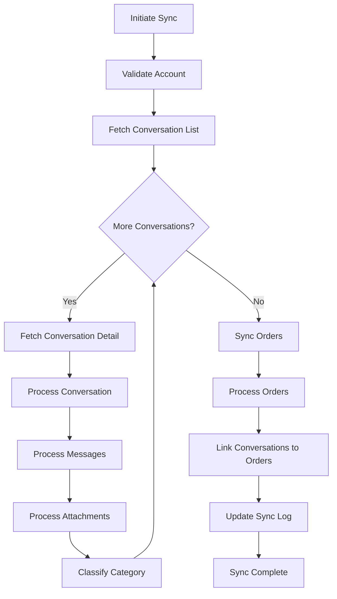

# eBay Message & Order Sync - Complete Workflow Documentation

**Version:** 1.0  
**Last Updated:** July 2, 2026  
**Author:** Development Team  

---

## Table of Contents

- [1. Overview](#1-overview)
- [2. Authentication & Authorization](#2-authentication--authorization)
  - [2.1 OAuth 2.0 Flow](#21-oauth-20-flow)
  - [2.2 Required Scopes](#22-required-scopes)
  - [2.3 Token Exchange](#23-token-exchange)
  - [2.4 API Request Headers](#24-api-request-headers)
- [3. API Structure](#3-api-structure)
  - [3.1 Conversation List API](#31-conversation-list-api)
  - [3.2 Conversation Detail API](#32-conversation-detail-api)
  - [3.3 Orders API](#33-orders-api)
- [4. Complete Workflow](#4-complete-workflow)
  - [4.1 High-Level Flow Diagram](#41-high-level-flow-diagram)
  - [4.2 Detailed Step-by-Step Process](#42-detailed-step-by-step-process)
- [5. Response Processing & Storage](#5-response-processing--storage)
  - [5.1 Conversation Processing](#51-conversation-processing)
  - [5.2 Message Processing](#52-message-processing)
  - [5.3 Attachment Processing](#53-attachment-processing)
  - [5.4 Category Classification](#54-category-classification)
- [6. Order Context Integration](#6-order-context-integration)
  - [6.1 Order Sync Flow](#61-order-sync-flow)
  - [6.2 Order Data Processing](#62-order-data-processing)
  - [6.3 Linking Conversations to Orders](#63-linking-conversations-to-orders)
- [7. Error Handling](#7-error-handling)
  - [7.1 Retry Logic](#71-retry-logic)
  - [7.2 Token Refresh](#72-token-refresh)
  - [7.3 Rate Limiting](#73-rate-limiting)
- [8. Database Schema](#8-database-schema)
- [9. API Usage Summary](#9-api-usage-summary)
- [10. Known Limitations & Future Improvements](#10-known-limitations--future-improvements)

---

## 1. Overview

### Purpose
This document provides a comprehensive technical overview of how the eBay help desk application synchronizes conversations, messages, and orders from eBay. The system uses eBay's REST APIs to fetch data, processes it, and stores it in the local database for display in the help desk interface.

### Key Components

| Component | File | Purpose |
|-----------|------|---------|
| **Authentication Client** | `ebay_auth_client.py` | OAuth 2.0 token management and API calls |
| **Sync Service** | `ebay_sync_service.py` | Orchestrates the entire sync process |
| **Message Service** | `ebay_message_service.py` | Processes conversations and messages |
| **Order Sync Service** | `ebay_order_sync_service.py` | Synchronizes orders from eBay |
| **Order Context Service** | `order_context_service.py` | Links conversations to orders |

### Flow Overview

```
User Action → Sync Service → eBay APIs → Process Response → Store in Database → Display in UI
```

---

## 2. Authentication & Authorization

### 2.1 OAuth 2.0 Flow

The application uses eBay's OAuth 2.0 implementation for secure API access.

#### Authorization URL
```http
https://auth.ebay.com/oauth2/authorize
```

#### Token URL
```http
https://api.ebay.com/identity/v1/oauth2/token
```

#### Sandbox URLs
```http
https://auth.sandbox.ebay.com/oauth2/authorize
https://api.sandbox.ebay.com/identity/v1/oauth2/token
```

### 2.2 Required Scopes

```python
EBAY_OAUTH_SCOPES = [
    'https://api.ebay.com/oauth/api_scope/commerce.message',      # For messages
    'https://api.ebay.com/oauth/api_scope/commerce.identity.readonly',
    'https://api.ebay.com/oauth/api_scope/sell.inventory',
    'https://api.ebay.com/oauth/api_scope/sell.fulfillment',      # For orders
]
```

### 2.3 Token Exchange

#### Request
```http
POST /identity/v1/oauth2/token HTTP/1.1
Host: api.ebay.com
Authorization: Basic <base64(client_id:client_secret)>
Content-Type: application/x-www-form-urlencoded

grant_type=authorization_code&
code=<authorization_code>&
redirect_uri=<redirect_uri>
```

#### Response
```json
{
  "access_token": "v^1.1#i^1#...",
  "refresh_token": "v^1.1#i^1#...",
  "expires_in": 7200,
  "refresh_token_expires_in": 47304000
}
```

### 2.4 API Request Headers

Every API call includes the following headers:

```http
Authorization: Bearer <access_token>
Accept: application/json
Content-Type: application/json  (for POST requests)
```

---

## 3. API Structure

### 3.1 Conversation List API

#### Endpoint
```http
GET /commerce/message/v1/conversation
```

#### Base URLs
| Environment | URL |
|-------------|-----|
| Production | `https://api.ebay.com/commerce/message/v1/conversation` |
| Sandbox | `https://api.sandbox.ebay.com/commerce/message/v1/conversation` |

#### Parameters

| Parameter | Type | Required | Description | Example |
|-----------|------|----------|-------------|---------|
| `conversation_type` | string | Yes | Type of conversation | `FROM_MEMBERS` or `FROM_EBAY` |
| `limit` | integer | No | Items per page (max 100) | `50` |
| `offset` | integer | No | Pagination offset | `0` |

#### Request Example
```http
GET /commerce/message/v1/conversation?conversation_type=FROM_MEMBERS&limit=50&offset=0 HTTP/1.1
Host: api.ebay.com
Authorization: Bearer v^1.1#i^1#...
Accept: application/json
```

#### Response Structure
```json
{
  "total": 150,
  "conversations": [
    {
      "conversationId": "conv_12345",
      "conversationType": "FROM_MEMBERS",
      "conversationStatus": "ACTIVE",
      "conversationTitle": "Question about Rapa valve",
      "referenceId": "v1|1234567890|0",
      "referenceType": "ITEM",
      "unreadCount": 2,
      "createdDate": "2026-06-30T11:20:00.000Z",
      "latestMessage": {
        "messageId": "msg_67890",
        "senderUsername": "buyer123",
        "recipientUsername": "yourstore_username",
        "createdDate": "2026-06-30T11:20:00.000Z"
      }
    },
    {
      "conversationId": "conv_12346",
      "conversationType": "FROM_MEMBERS",
      "conversationStatus": "ACTIVE",
      "conversationTitle": "Price inquiry",
      "referenceId": "v1|1234567891|0",
      "referenceType": "ITEM",
      "unreadCount": 0,
      "createdDate": "2026-06-29T15:30:00.000Z",
      "latestMessage": {
        "messageId": "msg_67891",
        "senderUsername": "buyer456",
        "recipientUsername": "yourstore_username",
        "createdDate": "2026-06-29T15:30:00.000Z"
      }
    }
  ]
}
```

### 3.2 Conversation Detail API

#### Endpoint
```http
GET /commerce/message/v1/conversation/{conversation_id}
```

#### Parameters

| Parameter | Type | Required | Description | Example |
|-----------|------|----------|-------------|---------|
| `conversation_id` | string (path) | Yes | Conversation ID | `conv_12345` |
| `conversation_type` | string | Yes | Type of conversation | `FROM_MEMBERS` or `FROM_EBAY` |
| `limit` | integer | No | Messages per page | `50` |
| `offset` | integer | No | Pagination offset | `0` |

#### Request Example
```http
GET /commerce/message/v1/conversation/conv_12345?conversation_type=FROM_MEMBERS&limit=50&offset=0 HTTP/1.1
Host: api.ebay.com
Authorization: Bearer v^1.1#i^1#...
Accept: application/json
```

#### Response Structure
```json
{
  "conversationId": "conv_12345",
  "conversationType": "FROM_MEMBERS",
  "conversationStatus": "ACTIVE",
  "conversationTitle": "Question about Rapa valve",
  "referenceId": "v1|1234567890|0",
  "referenceType": "ITEM",
  "createdDate": "2026-06-30T11:20:00.000Z",
  "unreadCount": 2,
  "messages": [
    {
      "messageId": "msg_67890",
      "senderUsername": "buyer123",
      "recipientUsername": "yourstore_username",
      "createdDate": "2026-06-30T11:20:00.000Z",
      "messageBody": "Hello, do you have the 0-24 bar version?",
      "readStatus": true,
      "messageMedia": []
    },
    {
      "messageId": "msg_67891",
      "senderUsername": "yourstore_username",
      "recipientUsername": "buyer123",
      "createdDate": "2026-06-30T11:25:00.000Z",
      "messageBody": "Yes, we have 9 units in stock",
      "readStatus": true,
      "messageMedia": []
    },
    {
      "messageId": "msg_67892",
      "senderUsername": "buyer123",
      "recipientUsername": "yourstore_username",
      "createdDate": "2026-06-30T11:26:00.000Z",
      "messageBody": "Great! I'll take 3 units",
      "readStatus": false,
      "messageMedia": []
    }
  ]
}
```

### 3.3 Orders API

#### Endpoint
```http
GET /sell/fulfillment/v1/order
```

#### Base URLs
| Environment | URL |
|-------------|-----|
| Production | `https://api.ebay.com/sell/fulfillment/v1/order` |
| Sandbox | `https://api.sandbox.ebay.com/sell/fulfillment/v1/order` |

#### Parameters

| Parameter | Type | Required | Description | Example |
|-----------|------|----------|-------------|---------|
| `limit` | integer | No | Items per page (max 200) | `200` |
| `offset` | integer | No | Pagination offset | `0` |
| `filter` | string | No | Filter by last modified date | `lastmodifieddate:[2026-06-30T00:00:00.000Z..2026-07-02T23:59:59.000Z]` |

#### Request Example
```http
GET /sell/fulfillment/v1/order?limit=200&offset=0&filter=lastmodifieddate:[2026-06-30T00:00:00.000Z..2026-07-02T23:59:59.000Z] HTTP/1.1
Host: api.ebay.com
Authorization: Bearer v^1.1#i^1#...
Accept: application/json
```

#### Response Structure
```json
{
  "total": 45,
  "orders": [
    {
      "orderId": "1234567890",
      "creationDate": "2026-06-30T11:30:00.000Z",
      "lastModifiedDate": "2026-06-30T11:30:00.000Z",
      "buyer": {
        "username": "buyer123",
        "buyerRegistrationAddress": {
          "countryCode": "US"
        }
      },
      "orderLineItems": [
        {
          "itemId": "v1|1234567890|0",
          "title": "Rapa bv01 12 m13 solenoid valve",
          "quantity": 1,
          "total": {
            "value": "139.99",
            "currency": "USD"
          }
        }
      ],
      "pricingSummary": {
        "total": {
          "value": "139.99",
          "currency": "USD"
        }
      }
    }
  ]
}
```

---

## 4. Complete Workflow

### 4.1 High-Level Flow Diagram



### 4.2 Detailed Step-by-Step Process

#### Step 1: Initiate Sync

**File:** `ebay_sync_service.py` → `sync_account()`

```python
def sync_account(self, account_id: UUID, *, max_conversations: int | None = None):
    # 1.1 Validate account
    account = self._get_syncable_account(account_id)
    
    # 1.2 Ensure valid access token
    account = self._ensure_access_token(account)
    
    # 1.3 Create sync log
    sync_log = self.sync_log_service.start_sync(...)
    
    # 1.4 Prepare for incremental sync
    updated_since = account.last_sync_at
```

#### Step 2: Fetch Conversation List

**File:** `ebay_sync_service.py` → `_iter_conversation_summaries()`

```python
def _iter_conversation_summaries(self, account, *, max_conversations=None, updated_since=None):
    for conversation_type in ['FROM_MEMBERS', 'FROM_EBAY']:
        offset = 0
        while True:
            # 2.1 Call eBay API
            response = self._get_conversations_with_retry(
                account,
                conversation_type=conversation_type,
                limit=50,
                offset=offset,
            )
            
            # 2.2 Parse response
            payload = response.payload
            conversations = payload.get('conversations', [])
            
            # 2.3 Filter by last_activity_at (incremental sync)
            for conversation in conversations:
                last_activity_at = self._conversation_activity_at(conversation)
                if updated_since and last_activity_at <= updated_since:
                    continue
                yield conversation, payload.get('total')
            
            # 2.4 Pagination
            if not conversations or offset >= payload.get('total', 0):
                break
            offset += 50
```

#### Step 3: Fetch Conversation Detail

**File:** `ebay_sync_service.py` → `_get_conversation_detail_with_retry()`

```python
def _get_conversation_detail_with_retry(self, account, *, conversation_id, conversation_type):
    # 3.1 First attempt
    response = self.token_service.client.get_conversation_raw(
        account.access_token,
        conversation_id=conversation_id,
        conversation_type=conversation_type,
        limit=50,
        offset=0,
    )
    
    # 3.2 Retry on 401 (token expired)
    if response.status_code == 401:
        account = self._refresh_account_after_unauthorized(account)
        response = self.token_service.client.get_conversation_raw(
            account.access_token,
            conversation_id=conversation_id,
            conversation_type=conversation_type,
            limit=50,
            offset=0,
        )
    
    return response
```

#### Step 4: Process Conversation

**File:** `ebay_message_service.py` → `upsert_conversation()`

```python
def upsert_conversation(self, account, conversation_summary, conversation_detail, conversation_type):
    # 4.1 Extract data
    conversation_id = conversation_detail.get('conversationId')
    messages = conversation_detail.get('messages', [])
    
    # 4.2 Build values for database
    values = {
        'provider_account_id': account.id,
        'subject': self._conversation_subject(...),
        'buyer_identifier': self._other_party_username(...),
        'provider_conversation_status': conversation_detail.get('conversationStatus'),
        'provider_conversation_type': conversation_detail.get('conversationType'),
        'reference_id': conversation_detail.get('referenceId'),
        'reference_type': conversation_detail.get('referenceType'),
        'unread_count': conversation_summary.get('unreadCount', 0),
        'last_message_at': self._latest_message_at(...),
        'external_created_at': self._parse_ebay_datetime(...),
        'raw_payload': {'summary': conversation_summary, 'detail': conversation_detail},
    }
    
    # 4.3 Save to database (upsert)
    conversation, created = self.conversation_repository.upsert_by_provider_id(
        EBAY_PROVIDER_NAME,
        conversation_id,
        values,
    )
    
    # 4.4 Auto-classify category
    category_id = CategorizationService(self.db).classify_text(
        ' '.join([values.get('subject', ''), values.get('buyer_identifier', ''), ...])
    )
    if category_id and not conversation.category_manually_selected:
        conversation.category_id = category_id
    
    return conversation, created
```

#### Step 5: Process Messages

**File:** `ebay_message_service.py` → `upsert_messages()`

```python
def upsert_messages(self, account, conversation, conversation_detail):
    for message_payload in conversation_detail.get('messages', []):
        # 5.1 Extract data
        message_id = message_payload.get('messageId')
        sender_username = message_payload.get('senderUsername')
        recipient_username = message_payload.get('recipientUsername')
        
        # 5.2 Determine direction
        is_inbound = sender_username != account.ebay_username
        sender_type = MessageSenderType.CUSTOMER if is_inbound else MessageSenderType.AGENT
        
        # 5.3 Build values
        values = {
            'conversation_id': conversation.id,
            'sender_type': sender_type,
            'sender_identifier': sender_username,
            'recipient_identifier': recipient_username,
            'body': message_payload.get('messageBody', ''),
            'read_status': message_payload.get('readStatus'),
            'is_inbound': is_inbound,
            'sent_at': self._parse_ebay_datetime(message_payload.get('createdDate')),
            'raw_payload': message_payload,
        }
        
        # 5.4 Save to database (upsert)
        message, created = self.message_repository.upsert_by_provider_id(
            EBAY_PROVIDER_NAME,
            message_id,
            values
        )
        
        # 5.5 Process attachments
        self.message_repository.replace_attachments(
            message,
            self._attachments_from_message_payload(account, message_payload),
        )
        
        # 5.6 SLA & Notifications (for inbound messages)
        if created and is_inbound:
            SLAService(self.db).start_cycle(conversation, sent_at)
            if conversation.category_id:
                self._notify_category_owners(conversation, message.id)
```

---

## 5. Response Processing & Storage

### 5.1 Conversation Processing

**File:** `ebay_message_service.py` → `upsert_conversation()`

#### Extracted Fields

| Field | Source | Description |
|-------|--------|-------------|
| `conversation_id` | `conversationDetail.conversationId` | Unique eBay conversation ID |
| `subject` | Generated | Conversation title or first message |
| `buyer_identifier` | Extracted from messages | Buyer's username |
| `provider_conversation_status` | `conversationDetail.conversationStatus` | Status (ACTIVE, etc.) |
| `provider_conversation_type` | `conversationDetail.conversationType` | Type (FROM_MEMBERS, etc.) |
| `reference_id` | `conversationDetail.referenceId` | eBay item ID |
| `reference_type` | `conversationDetail.referenceType` | Type (ITEM, ORDER, etc.) |
| `unread_count` | `conversationSummary.unreadCount` | Number of unread messages |
| `last_message_at` | Most recent message timestamp | Latest message date |
| `external_created_at` | `conversationDetail.createdDate` | Conversation creation date |
| `raw_payload` | Full response | Complete response for debugging |

#### Storage: `conversations` Table

```sql
INSERT INTO conversations (
    id,
    provider_account_id,
    provider_conversation_id,
    subject,
    buyer_identifier,
    provider_conversation_status,
    provider_conversation_type,
    reference_id,
    reference_type,
    unread_count,
    last_message_at,
    external_created_at,
    raw_payload
) VALUES (...)
ON CONFLICT (provider_conversation_id) 
DO UPDATE SET ...;
```

### 5.2 Message Processing

**File:** `ebay_message_service.py` → `upsert_messages()`

#### Direction Detection

```python
def _is_inbound(self, message_payload, account):
    sender_username = message_payload.get('senderUsername')
    recipient_username = message_payload.get('recipientUsername')
    
    # If sender is not the store, it's inbound from customer
    if sender_username != account.ebay_username:
        return True
    
    # If recipient is not the store, it's outbound to customer
    if recipient_username != account.ebay_username:
        return False
    
    # Fallback: compare both
    return sender_username != account.ebay_username
```

#### Message Classification

| Condition | Sender Type | Direction |
|-----------|-------------|-----------|
| `sender_username == account.ebay_username` | AGENT | Outbound |
| `sender_username != account.ebay_username` | CUSTOMER | Inbound |

#### Storage: `messages` Table

```sql
INSERT INTO messages (
    id,
    conversation_id,
    provider_message_id,
    sender_type,
    sender_identifier,
    recipient_identifier,
    body,
    read_status,
    is_inbound,
    sent_at,
    raw_payload
) VALUES (...)
ON CONFLICT (provider_message_id) 
DO UPDATE SET ...;
```

### 5.3 Attachment Processing

**File:** `ebay_message_service.py` → `_attachments_from_message_payload()`

#### Supported Fields

```python
attachment_keys = [
    'messageMedia',      # eBay Message API
    'MessageMedia',      # Alternative casing
    'attachments',       # Generic field
    'messageAttachments',# Specific field
    'documents',         # Document field
    'files',             # File field
]
```

#### Attachment Extraction

```python
def _attachments_from_message_payload(self, account, message_payload):
    attachments = []
    
    # Find attachment payloads
    for key in attachment_keys:
        value = message_payload.get(key)
        if isinstance(value, list):
            attachment_payloads.extend(value)
        elif isinstance(value, dict):
            attachment_payloads.append(value)
    
    # Process each attachment
    for index, payload in enumerate(attachment_payloads):
        attachment = MessageAttachment(
            account_id=account.id,
            provider=EBAY_PROVIDER_NAME,
            provider_attachment_id=payload.get('attachmentId') or payload.get('documentId'),
            file_name=payload.get('fileName') or payload.get('name') or f'Attachment {index}',
            media_url=payload.get('mediaUrl') or payload.get('downloadUrl'),
            media_type=payload.get('mediaType'),
            mime_type=payload.get('mimeType') or payload.get('contentType'),
            file_size=payload.get('fileSize') or payload.get('size'),
            raw_payload=payload,
        )
        attachments.append(attachment)
    
    return attachments
```

#### Storage: `message_attachments` Table

```sql
INSERT INTO message_attachments (
    id,
    message_id,
    account_id,
    provider_attachment_id,
    file_name,
    media_name,
    media_url,
    media_type,
    mime_type,
    file_size,
    download_url,
    raw_payload
) VALUES (...);
```

### 5.4 Category Classification

**File:** `ebay_message_service.py` → `upsert_conversation()`

#### Classification Input

```python
classification_text = ' '.join([
    values.get('subject', ''),
    values.get('buyer_identifier', ''),
    values.get('reference_id', ''),
    *[message.get('messageBody', '') for message in messages]
])
```

#### Classification Process

1. **CategorizationService.classify_text()** analyzes the text
2. Uses AI/ML models to predict the most appropriate category
3. Returns a `category_id` if confidence threshold is met

#### Category Assignment

```python
category_id = CategorizationService(self.db).classify_text(classification_text)

if category_id and not conversation.category_manually_selected:
    conversation.category_id = category_id
```

**Note:** Manually selected categories are never overridden.

---

## 6. Order Context Integration

### 6.1 Order Sync Flow

**File:** `ebay_order_sync_service.py` → `sync_account()`

#### Incremental Sync

```python
def sync_account(self, account_id, *, commit=True):
    account = self.db.get(EbayAccount, account_id)
    
    # 1. Check if we need incremental sync
    previous_cursor = account.last_order_sync_at
    started_at = datetime.now(UTC)
    
    # 2. Build filter for incremental sync
    if previous_cursor is not None:
        start = previous_cursor - CURSOR_OVERLAP  # 5 minutes overlap
        filter_value = f'lastmodifieddate:[{self._ebay_datetime(start)}..{self._ebay_datetime(started_at)}]'
    else:
        filter_value = None  # Full sync
    
    # 3. Fetch orders with pagination
    offset = 0
    while True:
        page = self._fetch_page_with_retry(
            account,
            offset=offset,
            filter_value=filter_value,
        )
        
        # 4. Process each order
        for payload in page.orders:
            with self.db.begin_nested():
                self.order_context_service.upsert_order_payload(
                    account_id=account.id,
                    payload=payload
                )
                self.db.flush()
        
        # 5. Check for more pages
        if not page.has_more or not page.orders:
            break
        offset += len(page.orders)
    
    # 6. Match conversations to orders
    matched = self.match_account_conversations(account.id)
    
    # 7. Update sync timestamp
    account.last_order_sync_at = started_at
```

### 6.2 Order Data Processing

**File:** `order_context_service.py` → `upsert_order_payload()`

#### Extracted Fields

```python
order_data = {
    'order_id': payload.get('orderId'),
    'creation_date': payload.get('creationDate'),
    'last_modified_date': payload.get('lastModifiedDate'),
    'buyer_username': payload.get('buyer', {}).get('username'),
    'total_value': payload.get('pricingSummary', {}).get('total', {}).get('value'),
    'total_currency': payload.get('pricingSummary', {}).get('total', {}).get('currency'),
    'order_line_items': [
        {
            'item_id': item.get('itemId'),
            'title': item.get('title'),
            'quantity': item.get('quantity'),
            'price_value': item.get('total', {}).get('value'),
            'price_currency': item.get('total', {}).get('currency'),
            'raw_payload': item,
        }
        for item in payload.get('orderLineItems', [])
    ],
    'raw_payload': payload,
}
```

#### Storage Tables

**1. `orders` Table (Order Header)**

```sql
INSERT INTO orders (
    id,
    provider_account_id,
    provider_order_id,
    creation_date,
    last_modified_date,
    buyer_username,
    total_value,
    total_currency,
    raw_payload
) VALUES (...)
ON CONFLICT (provider_order_id) 
DO UPDATE SET ...;
```

**2. `order_line_items` Table (Order Items)**

```sql
INSERT INTO order_line_items (
    id,
    order_id,
    item_id,
    title,
    quantity,
    price_value,
    price_currency,
    raw_payload
) VALUES (...);
```

### 6.3 Linking Conversations to Orders

**File:** `order_context_service.py` → `link_conversation_context()`

#### Matching Strategies (Priority Order)

**Strategy 1: By Item ID**

```python
# Match using reference_id from conversation
def match_by_item_id(conversation):
    if conversation.reference_id:
        order_line = find_order_line_by_item_id(conversation.reference_id)
        if order_line:
            return order_line.order_id
    return None
```

**Strategy 2: By Buyer Username + Date Range**

```python
def match_by_buyer_and_date(conversation):
    if conversation.buyer_identifier:
        # Find orders from this buyer within 7 days
        orders = find_orders_by_buyer(
            username=conversation.buyer_identifier,
            date_range=(
                conversation.external_created_at - 7 days,
                datetime.now(UTC)
            )
        )
        if orders:
            return orders[0].order_id  # Most recent order
    return None
```

**Strategy 3: By Order ID**

```python
def match_by_order_id(conversation):
    if conversation.reference_type == 'ORDER':
        return conversation.reference_id
    return None
```

#### Result: `conversation_order_mappings` Table

```sql
INSERT INTO conversation_order_mappings (
    id,
    conversation_id,
    order_id,
    order_record_id
) VALUES (...);
```

---

## 7. Error Handling

### 7.1 Retry Logic

**File:** `ebay_order_sync_service.py` → `_fetch_page_with_retry()`

```python
def _fetch_page_with_retry(self, account, *, offset, filter_value):
    MAX_RETRIES = 3
    refreshed = False
    
    for attempt in range(1, MAX_RETRIES + 1):
        # Make the API call
        page = self.provider.fetch_page(
            account.access_token,
            limit=self.PAGE_SIZE,
            offset=offset,
            filter_value=filter_value,
        )
        
        # Case 1: Token expired (401)
        if page.status_code == 401 and not refreshed:
            account = self.token_service.refresh_access_token(account.id)
            refreshed = True
            continue
        
        # Case 2: Rate limited (429) or Server error (5xx)
        if page.status_code == 429 or page.status_code >= 500:
            if attempt < MAX_RETRIES:
                # Exponential backoff: 1s, 2s, 4s
                sleep(min(2 ** (attempt - 1), 4))
                continue
            raise OrderSyncError(f"Failed after {MAX_RETRIES} retries")
        
        # Case 3: Other client errors
        if page.status_code < 200 or page.status_code >= 300:
            raise OrderSyncError(
                f"eBay order listing failed with status {page.status_code}: {page.error}"
            )
        
        # Success
        return page
```

### 7.2 Token Refresh

**File:** `ebay_sync_service.py` → `_refresh_account_after_unauthorized()`

```python
def _refresh_account_after_unauthorized(self, account):
    logger.info('Refreshing eBay access token after 401 account_id=%s', account.id)
    refreshed_account = self.token_service.refresh_access_token(account.id)
    self.db.refresh(refreshed_account)
    return refreshed_account
```

### 7.3 Rate Limiting

**File:** `ebay_api_usage_service.py` → `reserve_calls()`

```python
def reserve_calls(self, count: int):
    """Reserve API calls to respect rate limits."""
    # Check if we have enough remaining calls
    if self.get_remaining_calls() < count:
        raise RateLimitExceededError(
            f"Rate limit exceeded. Need {count} calls, only {self.get_remaining_calls()} remaining"
        )
    
    # Reserve the calls
    self.reserved_calls += count
```

---

## 8. Database Schema

### Table: `conversations`

| Column | Type | Description |
|--------|------|-------------|
| `id` | UUID | Primary key |
| `provider_account_id` | UUID | Foreign key to `ebay_accounts` |
| `provider_conversation_id` | STRING | eBay conversation ID (unique) |
| `subject` | STRING | Conversation subject |
| `buyer_identifier` | STRING | Buyer's username |
| `provider_conversation_status` | STRING | Status from eBay |
| `provider_conversation_type` | STRING | Type from eBay |
| `reference_id` | STRING | eBay item or order ID |
| `reference_type` | STRING | 'ITEM' or 'ORDER' |
| `unread_count` | INTEGER | Number of unread messages |
| `last_message_at` | TIMESTAMP | Most recent message timestamp |
| `external_created_at` | TIMESTAMP | Conversation creation date |
| `category_id` | UUID | Foreign key to `categories` |
| `category_manually_selected` | BOOLEAN | True if manually assigned |
| `status` | STRING | OPEN, CLOSED, etc. |
| `raw_payload` | JSONB | Full eBay response |
| `created_at` | TIMESTAMP | Record creation date |
| `updated_at` | TIMESTAMP | Record update date |

### Table: `messages`

| Column | Type | Description |
|--------|------|-------------|
| `id` | UUID | Primary key |
| `conversation_id` | UUID | Foreign key to `conversations` |
| `provider_message_id` | STRING | eBay message ID (unique) |
| `sender_type` | STRING | 'CUSTOMER' or 'AGENT' |
| `sender_identifier` | STRING | Sender's username |
| `recipient_identifier` | STRING | Recipient's username |
| `body` | TEXT | Message content |
| `read_status` | BOOLEAN | True if read |
| `is_inbound` | BOOLEAN | True if from customer |
| `sent_at` | TIMESTAMP | Message timestamp |
| `raw_payload` | JSONB | Full eBay response |
| `created_at` | TIMESTAMP | Record creation date |
| `updated_at` | TIMESTAMP | Record update date |

### Table: `message_attachments`

| Column | Type | Description |
|--------|------|-------------|
| `id` | UUID | Primary key |
| `message_id` | UUID | Foreign key to `messages` |
| `account_id` | UUID | Foreign key to `ebay_accounts` |
| `provider_attachment_id` | STRING | eBay attachment ID |
| `file_name` | STRING | Original filename |
| `media_name` | STRING | Media name |
| `media_url` | TEXT | URL to media |
| `media_type` | STRING | Type (IMAGE, DOCUMENT, etc.) |
| `mime_type` | STRING | MIME type |
| `file_size` | INTEGER | Size in bytes |
| `download_url` | TEXT | Download URL |
| `raw_payload` | JSONB | Full eBay response |
| `created_at` | TIMESTAMP | Record creation date |

### Table: `orders`

| Column | Type | Description |
|--------|------|-------------|
| `id` | UUID | Primary key |
| `provider_account_id` | UUID | Foreign key to `ebay_accounts` |
| `provider_order_id` | STRING | eBay order ID (unique) |
| `creation_date` | TIMESTAMP | Order creation date |
| `last_modified_date` | TIMESTAMP | Last modification date |
| `buyer_username` | STRING | Buyer's username |
| `total_value` | DECIMAL | Order total value |
| `total_currency` | STRING | Currency code |
| `raw_payload` | JSONB | Full eBay response |
| `created_at` | TIMESTAMP | Record creation date |
| `updated_at` | TIMESTAMP | Record update date |

### Table: `order_line_items`

| Column | Type | Description |
|--------|------|-------------|
| `id` | UUID | Primary key |
| `order_id` | UUID | Foreign key to `orders` |
| `item_id` | STRING | eBay item ID |
| `title` | STRING | Item title |
| `quantity` | INTEGER | Quantity ordered |
| `price_value` | DECIMAL | Item price |
| `price_currency` | STRING | Currency code |
| `raw_payload` | JSONB | Full eBay response |
| `created_at` | TIMESTAMP | Record creation date |

### Table: `conversation_order_mappings`

| Column | Type | Description |
|--------|------|-------------|
| `id` | UUID | Primary key |
| `conversation_id` | UUID | Foreign key to `conversations` |
| `order_id` | UUID | Foreign key to `orders` |
| `order_record_id` | UUID | Alternative reference to `orders` |
| `created_at` | TIMESTAMP | Record creation date |

---

## 9. API Usage Summary

### Which APIs Are Called?

| API | Endpoint | Purpose | Frequency |
|-----|----------|---------|-----------|
| **Message API** | `GET /commerce/message/v1/conversation` | Fetch conversation list | Once per sync (paginated) |
| **Message API** | `GET /commerce/message/v1/conversation/{id}` | Fetch conversation detail | Once per conversation |
| **Fulfillment API** | `GET /sell/fulfillment/v1/order` | Fetch order data | Once per sync (paginated) |
| **Identity API** | `GET /commerce/identity/v1/user/` | Verify seller identity | Once when connecting account |

### What's NOT Called?

| API | Why Not |
|-----|---------|
| **Notification API** | Not needed for current functionality |
| **Inventory API** | Only used for product context enrichment |
| **Analytics API** | Not used in sync process |
| **Negotiation API** | Not currently implemented (future improvement) |

### API Call Count Per Sync

| Component | Calls | Notes |
|-----------|-------|-------|
| **Conversation List** | 1 + (total/50) | Paginated with 50 per page |
| **Conversation Detail** | 1 per conversation | For each conversation in list |
| **Orders List** | 1 + (total/200) | Paginated with 200 per page |

---

## 10. Known Limitations & Future Improvements

### Current Limitations

| Issue | Description | Impact |
|-------|-------------|--------|
| **"You sent an offer" Messages** | System notifications not fetched via Message API | Offer details not available in help desk |
| **Batch Sync Only** | Only updates when manually triggered or scheduled | Conversations not real-time |
| **No Webhook Support** | No real-time notifications from eBay | Delayed updates |
| **Limited Attachment Support** | Only basic attachment handling | Complex attachments may not display correctly |

### Future Improvements

#### 1. Add Negotiation API

**Purpose:** Fetch seller-initiated offer details

**Benefits:**
- Display "You sent an offer" messages with full details
- Show offer status (pending, accepted, expired)
- Track offer expiry times

**Implementation:**
```python
def fetch_sent_offers(self, account, item_id):
    # Call eBay Negotiation API
    response = self.client.get_offers(
        access_token=account.access_token,
        item_id=item_id,
        offer_status='ALL'
    )
    
    for offer in response.offers:
        # Create offer record
        offer_data = {
            'offer_id': offer.get('offerId'),
            'buyer_username': offer.get('buyer').get('username'),
            'price': offer.get('offeredAmount'),
            'status': offer.get('offerStatus'),
            'expires_at': offer.get('offerExpirationDate'),
            'message': offer.get('message'),
        }
        # Link to conversation
        link_offer_to_conversation(conversation, offer_data)
```

#### 2. Implement Webhook Integration

**Purpose:** Real-time updates from eBay

**Benefits:**
- Instant conversation updates
- No need for scheduled syncs
- Better user experience

**Implementation:**
```python
def handle_webhook(self, payload):
    if payload.event_type == 'NEW_MESSAGE':
        # Fetch new message immediately
        message = self.fetch_message(payload.message_id)
        # Update conversation in real-time
        self.update_conversation(message.conversation_id)
```

#### 3. Add Real-Time WebSocket Updates

**Purpose:** Push updates to frontend immediately

**Benefits:**
- Users see new messages instantly
- No page refresh needed
- Better support experience

**Implementation:**
```python
def notify_frontend(self, conversation_id, new_message):
    # Send WebSocket message to connected clients
    websocket_broadcast({
        'event': 'NEW_MESSAGE',
        'conversation_id': conversation_id,
        'message': new_message.to_dict()
    })
```

#### 4. Enhanced Attachment Support

**Purpose:** Better attachment handling

**Benefits:**
- Preview images in chat
- Download documents
- Support for all attachment types

**Implementation:**
```python
def process_attachment(self, attachment_payload):
    # Detect attachment type
    if attachment_payload.media_type == 'IMAGE':
        # Generate thumbnail
        thumbnail = create_thumbnail(attachment_payload.media_url)
        store_thumbnail(thumbnail)
    elif attachment_payload.media_type == 'DOCUMENT':
        # Extract text
        text = extract_text(attachment_payload.media_url)
        index_for_search(text)
```

---

## 11. Conclusion

### Summary

The eBay help desk application successfully syncs conversations, messages, and orders using:

1. **Message API** - Fetches conversations and messages
2. **Fulfillment API** - Fetches order details
3. **Identity API** - Verifies seller identity

The data is processed, linked, and stored in a structured database, providing a comprehensive view of customer interactions.

### Key Features

✅ OAuth 2.0 authentication  
✅ Incremental sync (only new/updated data)  
✅ Pagination support for large datasets  
✅ Retry logic with exponential backoff  
✅ Automatic token refresh  
✅ Conversation categorization  
✅ Order context linking  
✅ Attachment processing  
✅ SLA tracking  
✅ Notification system  

### Next Steps

1. **Add Negotiation API** for "You sent an offer" messages
2. **Implement Webhooks** for real-time updates
3. **Add WebSocket** for live UI updates
4. **Enhance Attachment Processing** for better previews

---

## Appendix A: Code References

### Key Files

| File | Purpose |
|------|---------|
| `app/modules/integrations/ebay/ebay_auth_client.py` | eBay API client with OAuth |
| `app/modules/integrations/ebay/services/ebay_sync_service.py` | Main sync orchestrator |
| `app/modules/integrations/ebay/services/ebay_message_service.py` | Message processing |
| `app/modules/integrations/ebay/services/ebay_order_sync_service.py` | Order sync |
| `app/services/order_context_service.py` | Order linking |
| `app/services/categorization_service.py` | AI classification |
| `app/services/sla_service.py` | SLA tracking |
| `app/services/notification_service.py` | Notifications |

### Environment Variables

```env
# eBay OAuth Configuration
EBAY_CLIENT_ID=your_client_id
EBAY_CLIENT_SECRET=your_client_secret
EBAY_REDIRECT_URI=https://your-app.com/ebay/callback
EBAY_RUNAME=your_runame
EBAY_ENVIRONMENT=PRODUCTION  # or SANDBOX
```

---

## Appendix B: Troubleshooting

### Common Issues

| Issue | Cause | Solution |
|-------|-------|----------|
| **401 Unauthorized** | Token expired | Auto-refresh implemented |
| **429 Too Many Requests** | Rate limit exceeded | Retry with backoff |
| **No conversations fetched** | Incorrect scopes | Check OAuth scopes |
| **Missing order data** | No sell.fulfillment scope | Re-authorize with scope |
| **Slow sync** | Too many conversations | Use incremental sync |

### Debugging

```python
# Enable debug logging
import logging
logging.basicConfig(level=logging.DEBUG)

# Log raw responses
logger.info('eBay API response: %s', response.payload)

# Check sync status
sync_result = sync_service.sync_account(account_id)
print(f"Synced {sync_result.conversations_processed} conversations")
print(f"Failed: {sync_result.conversations_failed}")
```

---

*End of Documentation*